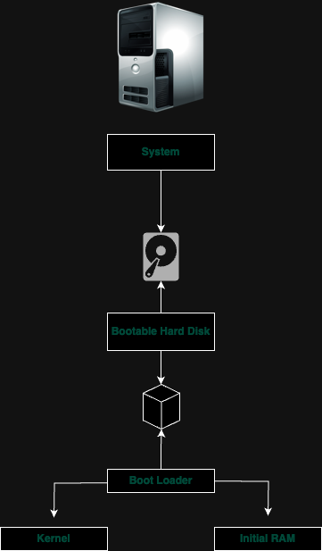

# Linux basicas and system startup

Power On

    

    &#8595;

- BIOS (Basic Input/Output system) &#8594; Initialize the screen and keyboard and tests the main memory

    &#8595;

- Master Boot Record (MBR) &#8594; Also known as First sector of the Hard disk

    &#8595;

- Boot Loader (e.g. GRUB) &#8594; Responsible to load the:
  - Kernel (Linux OS)
  - Initial RAM Disk

    &#8595;

    

